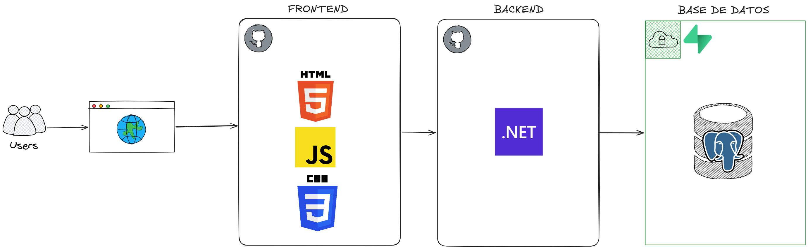
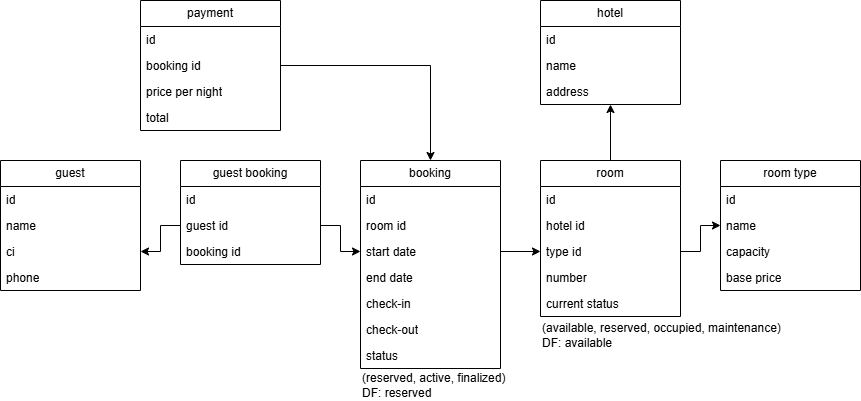

# Sistema de Gestión de Estadías de un Hotel

## 1. Alcance
El alcance del sistema está enfocado en el flujo principal de estadías en un hotel pequeño, que enfrenta varios problemas en su sistema actual como el solapamiento de las reservas e inconsistencia en los estados. El flujo abarca desde el registro de la estadía, asegurando la disponibilidad de la habitación y la correcta captura de datos del huésped, hasta la ejecución del check-in y el check-out asegurando la coherencia de los estados. El proceso finaliza con la persistencia del cálculo del costo total a pagar basado en la duración de la estadía y el tipo de habitación.

## 2. Historias de Usuario

## 3. Diagrama Arquitectura: Stack Tecnológico

## 4. Diagrama de Base de Datos

